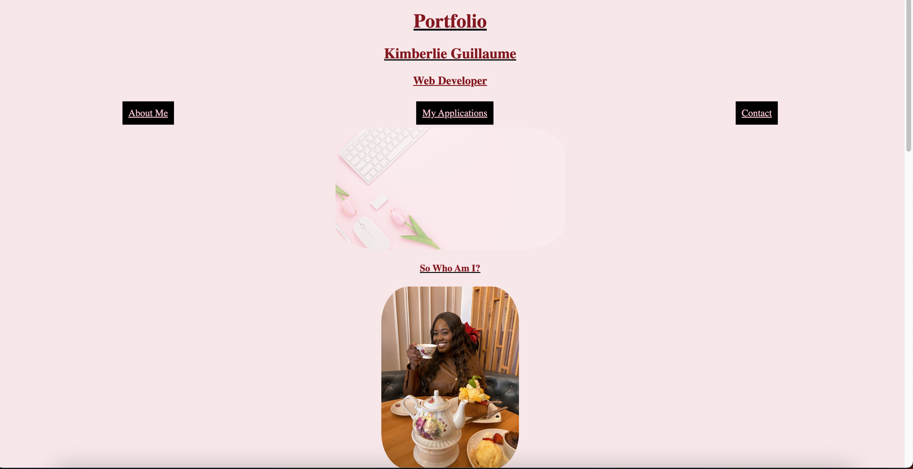

# <Advanced CSS Challenge: Professional Portfolio>

## Description

This respository is an example of a simple starter portfolio website

## Technologies Used 

- Visual Studio Code
- HTML
- CSS 

## Websites

[Deployed Application](https://kimberlie901.github.io/Professional_Portfolio/)
[Deployed Application](https://github.com/kimberlie901/Professional_Portfolio)

## License

Please refer to the LICENSE in the repo. Copyright (c) Kimberlie Guillaume. All rights reserved.

